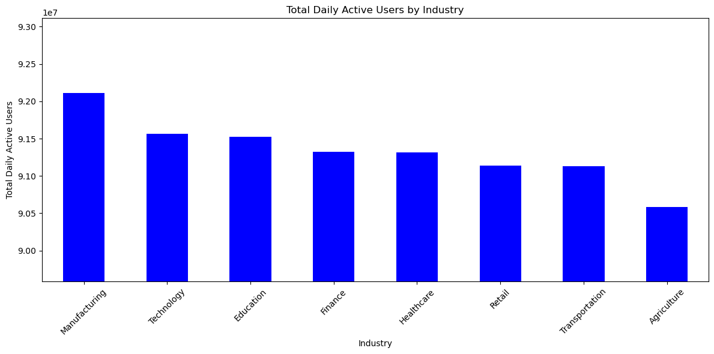

📊 Global AI Tool Adoption Across Industries

This project explores global trends in AI tool adoption across different industries using Python and data visualization techniques.

dataset: Global AI Tool Adoption Across Industries (from kaggle)

About Dataset:
-Global AI Tool Adoption Across Industries and Regions (2023–2025)
-A comprehensive, research-grade dataset capturing the adoption, usage, and impact of leading AI tools—such as ChatGPT, Midjourney, Stable Diffusion, Bard, and Claude—across multiple industries, countries

## 🎯 Objectives
- Analyze which AI tools are most widely adopted across industries
- Understand industry-wise engagement levels through daily active users
- Visualize key patterns using bar charts

- ## 📈 Visualizations

### 1. Total Daily Active Users by Industry

### 2. Most Adopted AI Tools (Overall)

## 🧰 Tools Used
- Python
- Pandas
- Seaborn
- Matplotlib
- Jupyter Notebook
